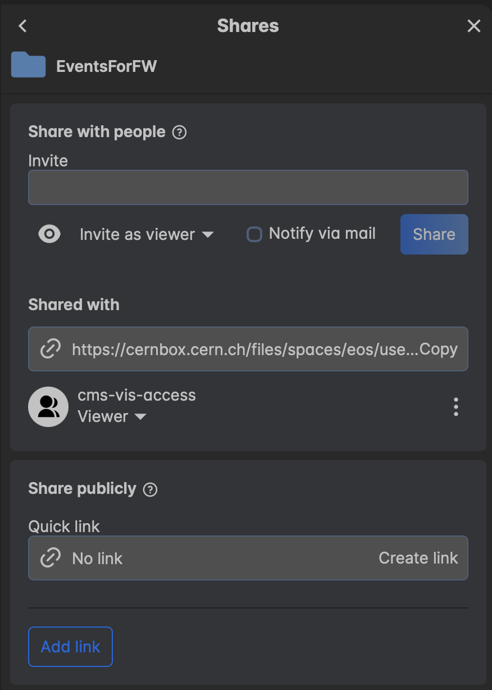
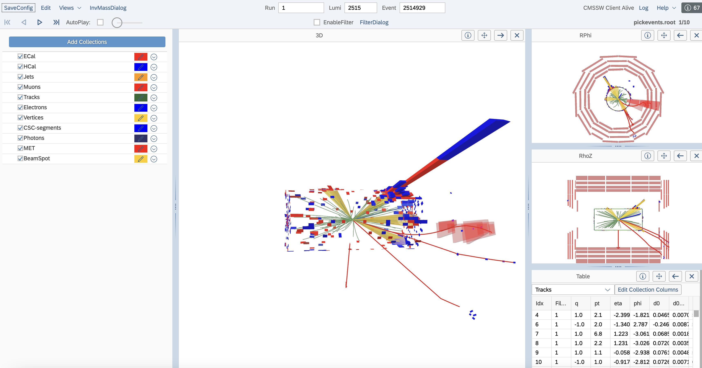

# Part 8 - Event Display (Optional)

This part shows how to visualize event topology with cmsShow.

## Python Setup

```bash
cd /path/to/CMSDAS

source /cvmfs/sft.cern.ch/lcg/views/LCG_106/x86_64-el8-gcc13-opt/setup.sh
python3 -m venv .venv
source .venv/bin/activate

python3 -c "import uproot,numpy; print('event display python setup ok')"
```

> #### **Checkpoint**
> Continue only after the package-import test succeeds.

## Pick Events

Run the script (example with ntuple input):

```bash
cd /path/to/CMSDAS/event_display
python3 event_display.py \
  --dataset "/ParkingDoubleMuonLowMass0/Run2025G-PromptReco-v1/MINIAOD" \
  --ntuple "/afs/ihep.ac.cn/users/y/yiyangzhao/Research/CMS_THU_Space/CMSDAS/data/selected/2025G0.root" \
  --max-events 5 \
  --output-dir results
```

Outputs:
- `event_display/output/event_display.txt`: event IDs in the format required by `edmPickEvents.py`.
- `event_display/output/selected_events.csv`: tabulated metadata (`run`, `lumi`, `event`, `fill`).
- `event_display/output/pickevents.root`: picked event content used for visual inspection.

> #### **Task**
> Run the script on your ntuple and verify that exactly 5 events were selected and written.

> #### **Checkpoint**
> Confirm that `pickevents.root` exists and is non-empty before moving to cmsShow.

## CERNBox Preparation
Before opening cmsShow, upload `pickevents.root` to CERNBox and grant viewer permission to `cms-vis-access`.

Steps:
1. Open [CERNBox](https://cernbox.cern.ch).
2. Create a folder for event display files.
3. Upload `pickevents.root`.
4. Share the folder with user/group `cms-vis-access` using Viewer permission.

<p align="center">
  
</p>

## Open Events in cmsShow
Open the cmsShow web interface:
- [https://fireworks.cern.ch](https://fireworks.cern.ch)

Then:
1. Load `pickevents.root` from your CERNBox location.
2. Open one event and inspect global topology.
3. Add/remove collections as needed from the left panel.
4. Iterate through all selected events.



> #### **Task**
> Inspect all 5 selected events and record at least two topology-level observations per event.

> #### **Question**
> 1. Which reconstructed features are easiest to interpret visually in cmsShow for your selected events?
> 2. Which details are difficult to evaluate from event display alone and still require quantitative analysis plots?
